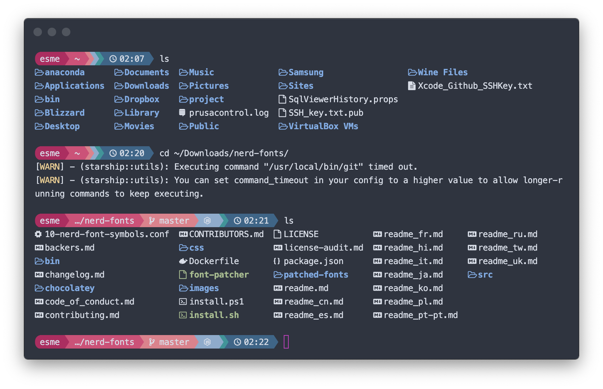

# Starship Powerline Style - Pastel Powerline: Kate

Pastel Powerline: Kate is a styling variant of the supported preset [Pastel Powerline](https://starship.rs/presets/#pastel-powerline). It is a classically feminine style designed to complement the widely supported [nord theme](https://www.nordtheme.com/).

## Installation

Drag and drop the `starship.toml` into `~/.config`. Hitting enter should reveal the new styling

If installing Starship for the first time, refer to installation instructions at [the Starship github page](https://github.com/starship/starship#-installation) for commands specific to your platform/distro.

## FAQ

Q: I followed your instructions but saw a bunch of `Unknown config key` errors, why is that?

A: The preset assumes that you are using Starship version 1.7.1. Your distro may not be packaging the latest version. You may either comment out the offending keys, or the latest version of Starship via `cargo`.

## Acknowledgements

Colour scheme based on the [Feminine Can Be Strong colour scheme](https://www.schemecolor.com/feminine-can-be-strong.php)